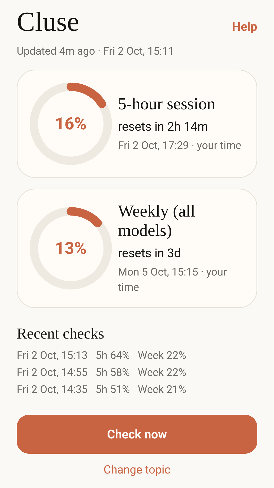
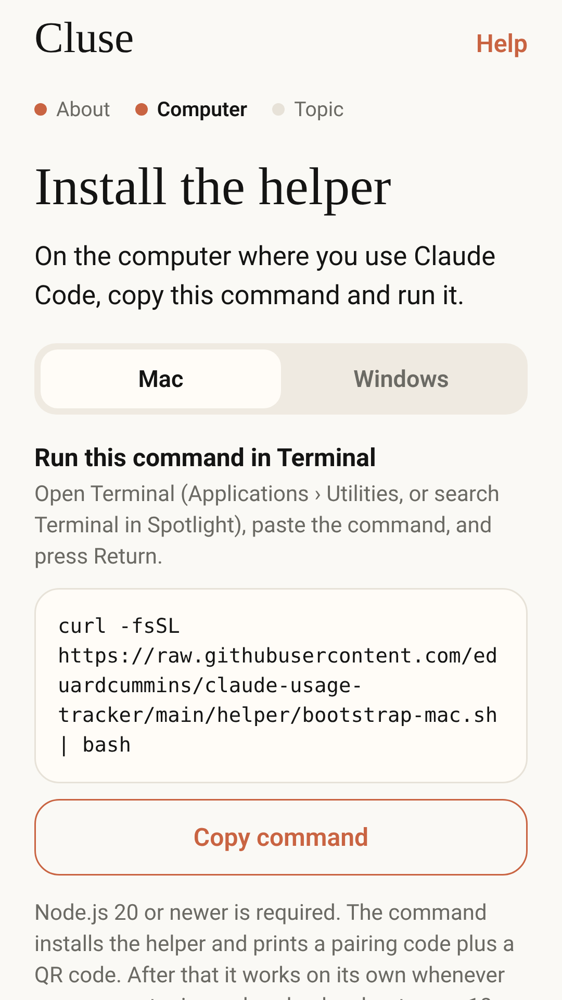
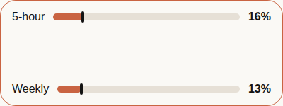

# Cluse

Cluse shows how much of your 5-hour and weekly Claude limits you've used, and lets you know when they reset.

<p>
  
  &nbsp;
  
</p>



Each limit shows the percent used, a countdown, and the reset time in your local time. You get a notification when a limit resets, and simple Android home screen widgets show the same numbers at a glance.

A small helper on your Mac or Windows computer reads your usage from the Claude Code login that is already there and sends it, encrypted, to the phone. It works whenever your computer is awake.

## Install

You need Claude Code signed in on your computer with a Claude subscription, and [Node.js](https://nodejs.org) 20 or newer.

1. **Get the app.** Cluse for Android is in closed testing on Google Play. To join the test, email [eduardcummins@gmail.com](mailto:eduardcummins@gmail.com?subject=Cluse%20testing). There is no iPhone version yet.
2. **Run one command on your computer.** The app shows this command too, with a button to copy it.

   **Mac:** open Terminal, paste this and press Return:

   ```bash
   curl -fsSL https://raw.githubusercontent.com/eduardcummins/claude-usage-tracker/main/helper/bootstrap-mac.sh | bash
   ```

   **Windows:** open PowerShell, paste this and press Enter:

   ```powershell
   irm https://raw.githubusercontent.com/eduardcummins/claude-usage-tracker/main/helper/bootstrap-windows.ps1 | iex
   ```

   The command installs the helper, sets it to check about every 10 minutes in the background, and shows a pairing code with a QR code.

## Pair your phone

1. Open Cluse and follow the setup.
2. Tap **Scan QR code** and scan the code on your computer screen, or paste the pairing code and tap **Save**.
3. Allow notifications when the phone asks, so you hear when a limit resets.

To add a widget, long-press your home screen, tap **Widgets**, and add **Cluse**.

## Uninstall

Uninstall the app from your phone as usual. To remove the helper from your computer:

**Mac**, in Terminal:

```bash
curl -fsSL https://raw.githubusercontent.com/eduardcummins/claude-usage-tracker/main/helper/uninstall-mac.sh | bash
```

**Windows**, in PowerShell:

```powershell
irm https://raw.githubusercontent.com/eduardcummins/claude-usage-tracker/main/helper/uninstall-windows.ps1 | iex
```

This stops the background check and deletes the helper, its settings and its logs. Node.js and your Claude Code login are not touched.

## Privacy

Cluse does not read your chats or files, and your usage is never sent to the developer. The helper encrypts the percentages on your computer before sending them through [ntfy.sh](https://ntfy.sh), and only your computer and your paired phone have the key. The camera is used only if you choose to scan the QR code. Read the full [privacy policy](https://eduardcummins.github.io/claude-usage-tracker/privacy.html).

Cluse is not affiliated with Anthropic. The figures come from the same account usage check that Claude Code uses. That check is not a published public API, so it can change.

## Feedback

Questions, bugs or ideas: [eduardcummins@gmail.com](mailto:eduardcummins@gmail.com?subject=Cluse%20feedback), or use **Send feedback** at the bottom of the app.

## For developers

How the encryption works, the helper's command-line options, running the tests and building the app are in [docs/DEVELOPMENT.md](docs/DEVELOPMENT.md).

Released under the [MIT License](LICENSE).
